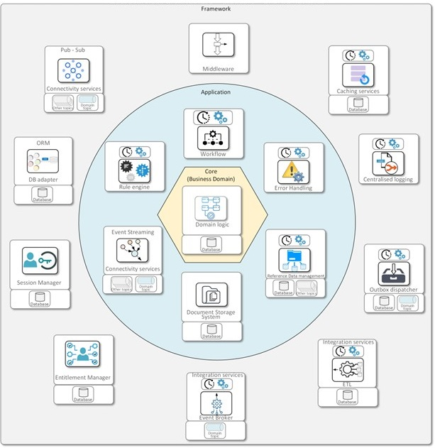
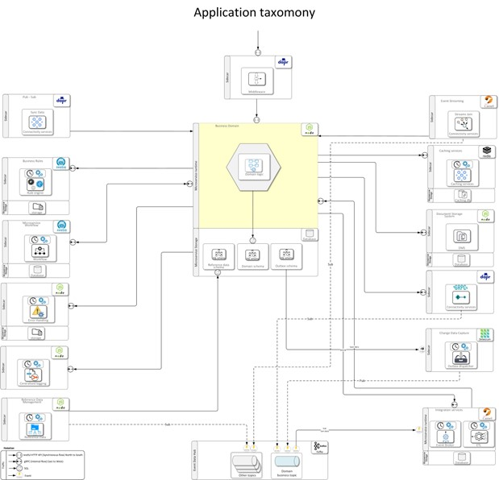

# hexagonal-architecture
hexagonal-architecture

 
 
 

## Intro
### Summary

The hexagonal architecture is known because of the Microservices architecture. However, it is not an exclusive design for microservices. The hexagonal architecture is an architectural pattern that Alistair Cockburn first detailed in 2005. The deployment options for designing these pluggable capabilities were not advanced; therefore, using shared libraries was the only option for implementing these. It is difficult to determine if this was a predecessor of the microservices architecture. The microservices architecture became mainstream, and at the same time, the runtime deployments evolved. Kubernetes allows having a microservice with multiple runtimes. One is dedicated exclusively to the business domain or logic, and the other is for utility services as required.  
From the viewpoint of Hexagonal Architecture as a business enterprise, this application taxonomy opens the possibility of creating the most optimal reusable components ever designed up to this time. On one side, these util capabilities can be designed in different languages, runtimes, and technology options. They are completely isolated from the business microservice and can evolve independently from any other. In addition, good versioning and deployment practices can be deployed and recycled without affecting the runtime of different components.  
These components provide a function through a standard interface; therefore, the development of business capabilities should not interfere with the many architecture options of a project; these technology decisions can be delayed until later stages. Moreover, even the deployment options can be delayed until later stages. This design allows several alternatives for deploying these utility services, and these can be:  
  
•	Embedded shared libraries in the business microservices runtime.  
•	A business microservices sidecar.  
•	Complete independent components.   
 
Building software components using this application architecture taxonomy opens a new economy of scale for software development, where the pieces, if well designed, could be reused on a large scale.  
 
#### References
Hexagonal_architecture_(software) Wikipedia  
https://en.wikipedia.org/wiki/Hexagonal_architecture_(software)  
Microservices - Wikipedia  
https://en.wikipedia.org/wiki/Microservices  
 
 
 

# Hexagonal architecture 
Hexagonal architecture is a design pattern whose main objective is to separate concerns about the business logic and technical code bases. This architecture allows the creation of an abstraction layer where all the input, outputs, and auxiliary functions are separated from the core domain logic.  
A hexagon shape represents this architectural pattern, with a business component in the core surrounded by the services on the six sides.   
This pattern is mainly used for application architectures and allows the creation of “ports” or “adapters“ for the business domain in the core. These services are bound with the core by using a defined interface. The design of these interfaces should be technology agnostic, and they should not constrain any language. So, it is possible to evolve the services without affecting the core.   
The overall idea is to have composable capabilities that can be reused. In addition, in most cases, these capabilities have become deployable units that can be utilised within business domain microservices, applications, or just stand-alone capabilities. These capabilities can take the shape of Libraries, Services, or sidecars. Nowadays, modern trends try to formalise these patterns as frameworks. The most known are Dapr and CloudState.  
This architecture allows late binding, postponing the implementation or deployment decisions to later stages of the development cycle.   
In terms of advantages and disadvantages, Hexagonal Architecture aims to increase the codebase’s maintainability by decoupling the core code from the rest, the packaging strategy, and the isolation of testing functionality. Regarding disadvantages, it adds some complexity to the build and debugging time; it may add latency because of the extra hops between the added abstraction layers.   
The services implemented in Hexagonal Architecture can be classified into three categories. Microsoft just started providing container services with built-in Dapr capabilities. However, only some of the hexagonal architecture capabilities proposed in this document are covered by Dapr nowadays.  
•	Domain Services  
They are components that are responsible for implementing the business domain logic. They follow the Domain-Driven Design (DDD) taxonomy. e.g., “Aggregated root”, “Value Object”, etc.  
•	Application Services  
They are components that are responsible for orchestrating the execution of domain logic. They conform to a layer with a defined interface that interacts with the business domain tailored per scenario.  
•	Framework Services  
Framework or Infrastructure Services are underlying components that contain the technology needed to run the Application.  

 

Creating a baselined architecture provides benefits such as architecture templates and reusable components, designed as shared utility functionality and abstracting the business domain logic modules from technical implementations.  

 

## Description	

### Business Domain 
A business domain defines the area of operation in an application or system. Domain-Driven Design is a sphere of knowledge, influence, or activity that can be conceptualised as a subject area to which the user applies for a program as the software domain. A DDD domain is a combination of the areas of:  
Knowledge: knowing what will happen with some data or events and typically the section in which you or your Application have the primary business perspective.  
Influence: like impacting your business with your actions or activities.  
Activity: Do specific tasks necessary with your knowledge and with whom you cause influence in your business area.  
### Caching Services	  
It is a component that provides the necessary methods for lifecycle content in a caching database. This database is faster than on-disk databases because they keep the content in memory, increasing throughput and lowering data retrieval latency.  
### Connectivity Services 
It is a component that implements the integration services and other primitive functions and provides these services to the business microservice. It abstracts protocol specifics, technical connectivity and retries, and message data formats.  
### Document Storage Manager (DMS) - Document Manager   
It is a module responsible for managing all types of images, documents and other types of structured and semi-structured collateral information collected as part of the normal operations of the Application.  
### Entitlement Manager  
It is a component that is responsible for granting, resolving, enforcing, revoking, and administering application and services fine-grained access entitlements (also referred to as “authorisations,” “privileges,” “access rights,” “permissions”, and “rules”).  
### Error Handler  
Error handling refers to anticipating, detecting, and resolving application, programming, or communication errors. It covers response and recovery procedures from error conditions present in a software application.  
### Event Streaming 
It refers to the technology that makes it possible to transform discreet input and output data units into a continuous stream. They can be consumed by one or many event topics, producing an event join condition. It only processes the delta records from the last run.  
### Integration Services  
It is a component that will centralise the integration with External Parties. It will contain all the data required to be autonomous and consist of sub-modules specialising in different protocols and flows. e.g., Events, HTTP, Files, Incoming, Outgoing, Batch, Synchronous, Asynchronous, etc.  
### Integration Services - Event Broker   
It is a module part of Integration Services and pushes data from the central system to External Systems. It allows capturing data changes on internal events and invokes call-back-URLs from External Systems.  
Integration Services  
### Integration Services - ETL   
Integration Services - ETL (Extract Transform and Load)  
The ETL is part of Integration Services. It retrieves (Extracts or Pulls) data sets from the External Systems, Transforms them, and Loads them into a central system. These External Systems should have been registered in our Integration Portal.  
### Logging services  
In a distributed system, each service generates its log trail. There could be transactions with problems that may include more than one service. Therefore, it is required to have a solution for standardising the lifecycle of logs, consisting of the logging format, local capture, shipping of the records, aggregating logs from each service instance, and facilitating the analysis of records. It is based on commodity technology: Fluentd, Open Search (a.k.a. Elastic Search), and Kibana Dashboards.
### ORM Services  
Object-relational mapping (ORM) is a design technique for converting data between an application and the database engine using an object-oriented programming paradigm. It provides the effect of a “virtual object database”, which facilitates the development of a business domain and business logic. In addition, it can provide extra benefits when implemented as a library or a sidecar. It abstracts all access and connectivity with the database. It follows the principles of separation of concerns based on domains and decentralised ownership by applying discrete responsibility to self-contained contexts as microservices. When referring to the microservices data, it creates a “data mesh” layer, a concept related to enabling “data as a product”. It conforms to distributed taxonomy and can be used by data analytics consuming “data as a service”.  
### Outbox dispatcher 
It is a design pattern that implements a Transactional Outbox, one of the best approaches for solving the “Dual Write” problem.  
The Dual Write problem for microservices is when they need to maintain their state private to them and then notify that change to a broader audience. So, this pattern aims to solve these two steps to be executed as a single task atomically. It is implemented as a component responsible for tracking the changes in the microservices’ database. In particular, the table is called  “Outbox“. The Outbox table will store documents with the changes done in the business schema, and these payloads will be published as Events in the Business Domain Topic.  
### Middleware	 
Allow intercepting and composing activities before and after the flow reaches the microservice.  
### Pub-Sub  
Publisher & Subscriber is an integration pattern where components called publishers place events (messages) on queues (or topics). And other system components called Subscribers consume these events. The Publishers and the Subscribers don’t know the existence of each other. The integration pattern allows message filtering, which is when the Subscribers decide to receive only a subset of the total messages published. There are two common forms of filtering: topic-based and content-based. In a topic-based system, the messages are published to “topics”.  
### Reference Data management  
Reference data is data used to classify or categorise other data. Typically, they are static or slowly changing over time. And the Reference Data Manager is a component responsible for managing an application’s reference data and simplifying how this data is shared across other components and systems.  
### Rule Engine- Business Rule Engine (BRE)   
It is specific software that allows defining, analysing, executing, auditing and maintaining various business logic, collectively called “rules.” It enables business stakeholders to keep updated on the rules using a simplified user interface to configure decision trees and tables.  
### Session Management  
It is a component responsible for the lifecycle management of the user session. The session is created after the user authenticates. For each API invocation, the system will validate if the session is valid before the flow reaches the Application. After some inactivity or expiration time, the session will become invalid.    
###  Workflow Engine (microservices-workflow)  
It is an end-to-end orchestrator of activities. The components of a system can be a participant in an end-to-end flow organised by a predetermined and organised business flow that allows tracking of a sequence of activities from start to end. In the context of microservices, the workflow invokes microservices components, therefore creating an orchestration pattern. Microservices are designed decoupled from one another. So, the orchestration pattern must be carefully planned and adapted to the microservices principles. It converts workflow orchestration into a loosely coupled integration between components. This type of workflow loosely connecting the microservices is a pattern known as “microservices-workflow”.  

 

## Technology Architecture

 

## Description
 

#	
### CDC	 (Change Data Capture)  
The Change data capture (CDC) is a software design pattern used to determine the data that has changed in a database. So all updates on a database can be published as events to an event data hub, allowing downstream components to process these events.  
### Dapr	  
Dapr is a free and open-sourced framework to implement utility services in microservices. It provides a runtime system designed to run as a sidecar, and it is mainly targeted to fit into the Kubernetes deployment taxonomy. Microsoft and Alibaba sponsor it.  
### Data Sink  
It is a component that will be configured to receive incoming events from other business domains and save these into the local business domain database.  
### Debezium	   
Debezium is an open-sourced distributed platform that implements CDC (Change Data Capture) model.  
It implements a Database Log Scanner, configuring the source database system to track any modifications made to the data within the database. As a result, it can publish events to the Event Data Hub using the data of these changes. So that other applications can start responding to all these events. Moreover, they will have all the data used for the inserts, updates, and deletes.   
In short, it is a technical enabler for achieving an Event-Driven Architecture because it captures changes in a business domain and publishes them.  
### Domain Business Topic	  
It is the main topic of a domain, where the business domain publishes the business events that occurred locally. It is a fundamental piece of the event-driven architecture model.  
### Event Data Hub	 
It is the backbone for event data processing and data integration. It handles all the events from all the domains and creates consistent streaming data flows consumed by application components.   
### gRPC	   
It is an open-sourced, high-performance Remote Procedure Call (RPC) framework that can run in any environment. It can efficiently connect services in and across data centres with pluggable support for load balancing, tracing, health checking and authentication.  
### Redis	  
Redis is an in-memory data structure store used as a distributed, in-memory key-value database, cache, and message broker, with optional durability. Redis supports different kinds of abstract data structures, such as strings, lists, maps, sets, sorted sets, bitmaps, streams, special indices, etc.  
### Sidecar	  
Sidecars are supporting processes or services that are deployed with the primary Application. They comply with and complement the microservice architecture and deployment-oriented architecture.  
The sidecar can provide, for example, some of the following services:   
1.	Caching  
2.	Change Data Capture (Outbox dispatcher)  
3.	Connectivity Services (Integration)  
4.	Data Sink  
5.	Error Handling  
6.	Event Streaming processing  
7.	Pub-Sub   
8.	Reference Data Management  
9.	Rule Engine  
10.	Workflow, etc  

 
 
 
